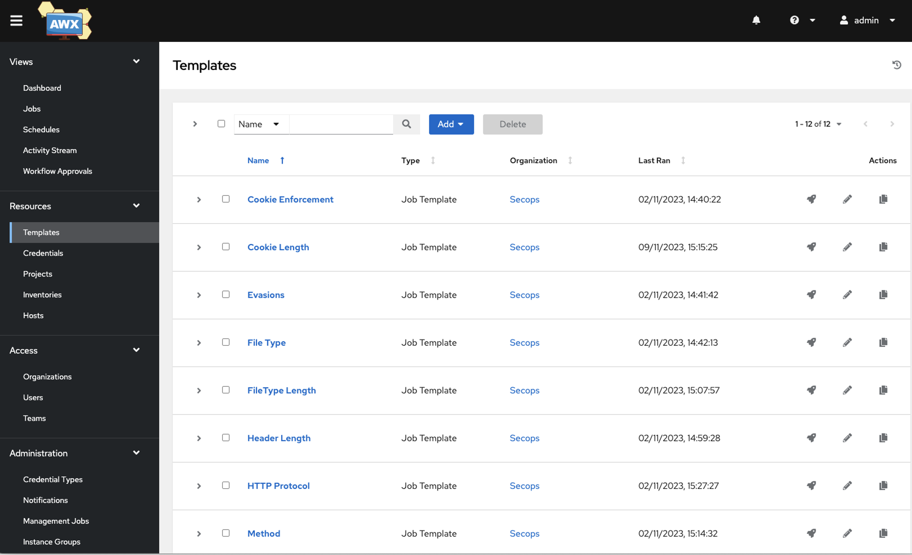

# Managing F5 and NGINX waf policies with Ansible
In this guide, we'll explore how to leverage this ansible galaxy collection (**`skenderidis.f5_waf`**) to fine-tune waf policies for BIGIP AWAF and NGINX AppProtect, that are stored in JSON or YAML files and are used to implement Security Automation (DevSecOps).
The collection aims to simplify the process of modifying and updating WAF policies, enabling seamless security automation for your web applications.

**The Need for Automation**

Managing WAF policies manually can be a daunting and time-consuming task, especially in large-scale web environments where policies require frequent updates to combat evolving threats. The traditional approach of manually modifying JSON or YAML files to manage these policies adds an additional layer of complexity, exacerbating the challenge.
However, an effective solution to this problem lies in leveraging automation tools such as Ansible. This Ansible collection offers a straightforward way to programmatically modify WAF policies, empowering users to automate security tasks and ensure continuous protection for their web applications.

Furthermore, by integrating this Ansible collection with Ansible Tower, SecOps teams can significantly streamline their workflows. Ansible Tower provides a centralized platform graphical user interface (GUI) for managing automation tasks, complete with features such as role-based access control, scheduling, and auditing. This integration simplifies the management of WAF policies, allowing teams to efficiently deploy and monitor changes across their web environments. Ultimately, it enables organizations to strengthen their security posture while minimizing the time and effort required for policy management.


<p align="center">
  
</p>


## Violations Supported

The current collection supports the most common violations that are available with F5 AWAF or NGINX App Protect. The table below lists all the violations supported by either F5 AWAF or NGINX App Protect and provides the module that has been created for that particular violation along with its documentation page. The name of the modules are similar to the violation name in order to keep consistency between modules and violation.

> If you require a specific violation, please raise a GitHub issue with more details.

| Violations  | module | Support | Status | |
| ------------- | ------------- | ------------- | ------------- | ------------- |
| Manage Blocking Settings  | blocking_settings  |  AWAF / NAP  | [Documentation](violations/blocking_settings/) |
| Manage Enforcement Mode | enforcement_mode  |  AWAF / NAP  | [Documentation](violations/enforcement/) |
| VIOL_ATTACK_SIGNATURE  | viol_attack_signature  |  AWAF / NAP  | [Documentation](violations/viol_attack_signature/) |
| VIOL_ATTACK_SIGNATURE  | viol_attack_signature_global  |  AWAF / NAP  | [Documentation](violations/viol_attack_signature_global/) |
| VIOL_FILETYPE | viol_filetype  |  AWAF / NAP  | [Documentation](violations/viol_filetype/)| 
| VIOL_POST_DATA_LENGTH | viol_post_data_length  |  AWAF / NAP  | [Documentation](violations/viol_post_data_length/) |
| VIOL_QUERY_STRING_LENGTH | viol_query_string_length  |  AWAF / NAP  | [Documentation](violations/viol_query_string_length/) |
| VIOL_REQUEST_LENGTH | viol_request_length  |  AWAF / NAP  | [Documentation](violations/viol_request_length/) |
| VIOL_URL_LENGTH | viol_url_length  |  AWAF / NAP  | [Documentation](violations/viol_url_length/) |
| VIOL_HTTP_PROTOCOL | viol_http_protocol  |  AWAF / NAP  | [Documentation](violations/viol_http_protocol/) |
| VIOL_EVASION | viol_evasion  |  AWAF / NAP  | [Documentation](violations/viol_evasion/) |
| VIOL_URL  |  viol_url  |  AWAF / NAP  | [Documentation](violations/viol_url/) |
| VIOL_METHOD  |  viol_method  |  AWAF / NAP  | [Documentation](violations/viol_method/) |
| VIOL_HEADER_LENGTH  |  viol_header_length  |  AWAF / NAP  | [Documentation](violations/viol_header_length/) |
| VIOL_COOKIE_LENGTH  |  viol_cookie_length  |  AWAF / NAP  | [Documentation](violations/viol_cookie_length/) |
| VIOL_COOKIE_MODIFIED  |  viol_cookie_modified  |  AWAF / NAP  | [Documentation](violations/viol_cookie_modified/) |
| VIOL_HTTP_RESPONSE_STATUS  |  viol_http_response_status  |  AWAF / NAP  | [Documentation](violations/viol_http_response_status/) |
| VIOL_THREAT_CAMPAIGN  |  viol_threat_campaign |  AWAF / NAP  | [Documentation](violations/viol_threat_campaign/) |
| VIOL_PARAMETER  |  viol_parameter  |  AWAF / NAP  | [Documentation](violations/viol_parameter/) |
| VIOL_MANDATORY_HEADER  |  viol_mandatory_header  |  AWAF / NAP  | [Documentation](violations/viol_mandatory_header/) |
| VIOL_MANDATORY_PARAMETER  | viol_mandatory_parameter   |  AWAF / NAP  | [Documentation](violations/viol_mandatory_parameter/) |
| VIOL_PARAMETER_EMPTY_VALUE  |  viol_parameter_empty_value  |  AWAF / NAP  | [Documentation](violations/viol_parameter_empty_value/) |
| VIOL_PARAMETER_REPEATED  |  viol_parameter_repeated  |  AWAF / NAP  | [Documentation](violations/viol_parameter_repeated/) |
| VIOL_PARAMETER_DATA_TYPE  |  viol_parameter_data_type  |  AWAF / NAP  | [Documentation](violations/viol_parameter_data_type/) |
| VIOL_PARAMETER_LOCATION  |    |  - / -  | [Pending]() |
| VIOL_PARAMETER_NAME_METACHAR  |    |  - / -  | [Pending]() |
| VIOL_PARAMETER_VALUE_METACHAR  |    |  - / -  | [Pending]() |
| VIOL_URL_METACHAR  |    |  - / -  | [Pending]() |
| VIOL_HEADER_METACHAR  |    |  - / -  | [Pending]() |
| VIOL_MANDATORY_REQUEST_BODY  |    |  - / -  | [Pending]() |
| VIOL_PARAMETER_ARRAY_VALUE  |    |  - / -  | [Pending]() |
| VIOL_PARAMETER_MULTIPART_NULL_VALUE  |    |  - / -  | [Pending]() |
| VIOL_PARAMETER_NUMERIC_VALUE  |    |  - / -  | [Pending]() |
| VIOL_PARAMETER_STATIC_VALUE  |    |  - / -  | [Pending]() |
| VIOL_PARAMETER_VALUE_BASE64  |    |  - / -  | [Pending]() |
| VIOL_PARAMETER_VALUE_LENGTH  |    |  - / -  | [Pending]() |
| VIOL_PARAMETER_VALUE_REGEXP  |    |  - / -  | [Pending]() |
| VIOL_RATING_THREAT  |    |  - / -  | [Pending]() |
| VIOL_RATING_NEED_EXAMINATION  |    |  - / -  | [Pending]() |
| VIOL_BOT_CLIENT  |    |  - / -  | [Pending]() |
| VIOL_ASM_COOKIE_MODIFIED  |    |  - / -  | [Pending]() |
| VIOL_BLACKLISTED_IP  |    |  - / -  | [Pending]() |
| VIOL_COOKIE_EXPIRED  |    |  - / -  | [Pending]() |
| VIOL_COOKIE_MALFORMED  |    |  - / -  | [Pending]() |
| VIOL_DATA_GUARD  |    |  - / -  | [Pending]() |
| VIOL_ENCODING  |    |  - / -  | [Pending]() |
| VIOL_FILE_UPLOAD  |    |  - / -  | [Pending]() |
| VIOL_FILE_UPLOAD_IN_BODY  |    |  - / -  | [Pending]() |
| VIOL_GRAPHQL_MALFORMED  |    |  - / -  | [Pending]() |
| VIOL_GRAPHQL_FORMAT  |    |  - / -  | [Pending]() |
| VIOL_GRAPHQL_INTROSPECTION_QUERY  |    |  - / -  | [Pending]() |
| VIOL_GRAPHQL_ERROR_RESPONSE  |    |  - / -  | [Pending]() |
| VIOL_GRPC_FORMAT  |    |  - / -  | [Pending]() |
| VIOL_GRPC_MALFORMED  |    |  - / -  | [Pending]() |
| VIOL_GRPC_METHOD  |    |  - / -  | [Pending]() |
| VIOL_JSON_FORMAT  |    |  - / -  | [Pending]() |
| VIOL_JSON_MALFORMED  |    |  - / -  | [Pending]() |
| VIOL_JSON_SCHEMA  |    |  - / -  | [Pending]() |
| VIOL_REQUEST_MAX_LENGTH  |    |  - / -  | [Pending]() |
| VIOL_URL_CONTENT_TYPE  |    |  - / -  | [Pending]() |
| VIOL_XML_FORMAT  |    |  - / -  | [Pending]() |
| VIOL_XML_MALFORMED  |    |  - / -  | [Pending]() |


## How to use the collection

1. Ensure that Ansible is installed on your local machine or Ansible control node. You can find more information regarding the installation on https://docs.ansible.com/ansible/latest/installation_guide/intro_installation.html

2. Install the **`skenderidis.f5_waf`** collection that is hosted in Galaxy. By default, Ansible installs the collection in ~/.ansible/collections under the ansible_collections directory.
```
ansible-galaxy collection install skenderidis.f5_waf --upgrade
```

3. Use any of the modules in the **`skenderidis.f5_waf`** collection. In the following example we are running the Ansible playbook to allow a specific **URL**.

    ```yaml
    - name: VIOL_URL
      hosts: localhost
      collections:
        - skenderidis.f5_awaf         
      tasks:
        - name: Allow/Disallow a specific url
          url:
            url: index.php
            enabled: True
            policy_path: waf_policy.json
            format: json
    ```

## How to modify a policy that is stored on a GIT repository

The following ansible playbook shows how you can clone a repository, change the waf policy and then push the policy back to the repository by creating a new branch if it doesnt already exists.
At the end, the playbook will create a Merge request in order to notify the repository owner that they need to accept the changes done by Ansible.


```yaml
- name: Modifying the Cookie Length Settings
  hosts: localhost
  collections:
    - skenderidis.f5_waf

  tasks:
    # Clean-up task to delete the existing Git folder and its contents
    - name: Clean-up. Deleting the Git folder and its contents
      file:
        path: git
        state: absent

    # Creating a new Git folder
    - name: Creating a new Git folder
      file:
        path: git
        state: directory

    # Cloning Git repository with NAP Policies 
    - name: Clone Git repository with NAP Policies 
      git:
        repo: "{{repo}}"  # The URL of the Git repository to clone
        dest: git  # Specify the local directory where you want to clone the repo
        version: main  # Specify the branch you want to fetch

    # Checking if the policy file exists
    - name: Check if the file exists
      stat:
        path: "git/{{policy}}.{{format}}"
      register: file_stat_result

    # Ending the playbook if the policy file is not found
    - name: Ending playbook because File was not found
      meta: end_play
      when: file_stat_result.stat.exists == False

    # Checking out the specified branch or creating a new one if it doesn't exist
    - name: Checkout Branch
      shell: |
        exists=$(git ls-remote --heads origin "{{policy}}")
        echo $exists
        if [ -n "$exists" ]; then
          echo "{{policy}}" branch exists;
          git branch -a
          git checkout main
          git pull
          git checkout "{{policy}}"
        else
          echo "{{policy}}" branch does NOT exist;
          git branch -a
          git checkout main
          git pull
          git checkout -b"{{policy}}"
        fi
      args:
        warn: no
        chdir: git

    # Modifying the signature globally
    - name: Modify signature globally
      viol_attack_signature_global:
        signature_id: "{{sigID}}"  # The ID of the signature to modify
        enabled: "{{enabled}}"  # Whether the signature is enabled or disabled
        policy_path: "git/{{policy}}.{{format}}"  # Path to the policy file
        format: "{{format}}"  # Format of the policy file (e.g., JSON or YAML)
      register: policy_output

    # Displaying the policy output for debugging
    - name: Show policy output
      debug:
        var: policy_output

    # Ending the playbook if no changes were made to the policy
    - name: Ending playbook because No changes in the policy
      meta: end_play
      when: policy_output.changed == False or policy_output.failed == True

    # Committing changes to the Git repository
    - name: Commit Changes
      shell: |
        git config --global user.email {{email}}
        git config --global user.name {{user}}
        git add {{policy}}.{{format}}
        git commit -m "Cookie max length was changed to value:{{value}}, by Tower jobID:{{tower_job_id}} and Tower User:{{tower_user_name}}"
      args:
        chdir: git

    # Pushing changes and creating a merge request
    - name: Push Changes and create a merge request
      shell: |
        git push -u origin HEAD \
          -o merge_request.create \
          -o merge_request.title="New Merge Request: $(git branch --show-current)" \
          -o merge_request.description="This MR was created by the Template:<{{tower_job_template_name}}>" \
          -o merge_request.target=main \
          -o merge_request.remove_source_branch \
          -o merge_request.squash
      args:
        warn: no
        chdir: git
      register: push_output

    # Displaying push output for debugging
    - name: Show push output
      debug:
        var: push_output
```

## Support

For support, please open a GitHub issue.

### License
[Apache License 2.0](LICENSE)

